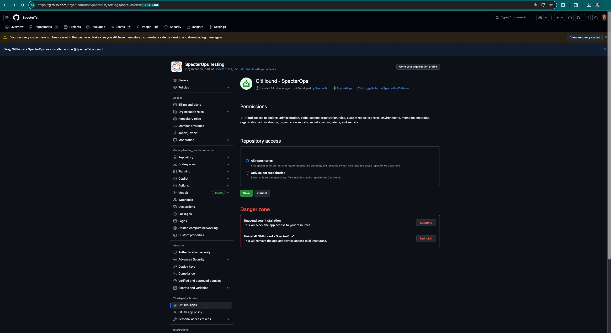
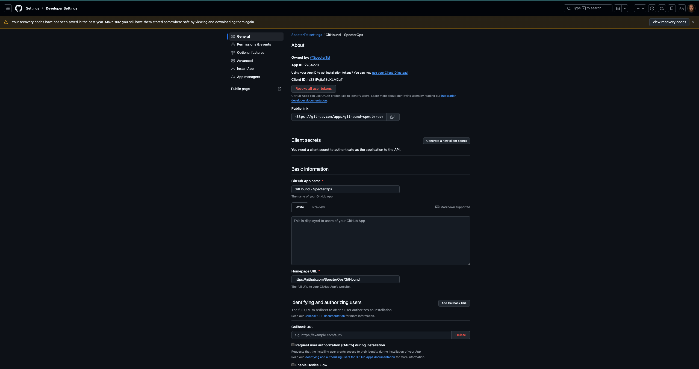

# Collection via App Installation

While it creates a few extra steps, it may be advantageous to perform collection via an App Installation due to GitHub's increased rate limit threshold for App Installations as compared to Personal Access Tokens (PAT).

## Install the App

## Get the App Installation Details

Go to settings, and make sure that you are in the context of your target GitHub Organization.

Find GitHub Apps in the menu under Third-party Access.

Locate the `GitHound - SpecterOps` App and select Configure.

This will take you to the following page. Notice the numeric value in the URL (`107643946` in the screenshot below). This is the Application Id that you will need in a subsequent step.



Next, click on the `App settings` menu to get detailed information about the App as shown below:



Keep track of the App Installation's `Client ID` value (`Iv23liPgjiu18oXLM2q7` in the screenshot above).

## Generate an installation access token

The step by step instructions for generating an installation access token can be found in [GitHub's documentation](https://docs.github.com/en/apps/creating-github-apps/authenticating-with-a-github-app/generating-an-installation-access-token-for-a-github-app#generating-an-installation-access-token). The goal of this section is to demonstrate how this can be done in conjunction with the GitHound collector.

Use the `New-GitHubJwtSession` function to generate a JWT for the App Installation. This function requires both the Client ID, from the previous step, and the private key that you generated when you installed the App.

    ```powershell
    $jwt = New-GitHubJwtSession -OrganizationName SpecterTst -ClientId Iv23liPgjiu18oXLM2q7 -PrivateKeyPath ~/Downloads/githound-specterops.2026-02-02.private-key.pem -AppId 107643946
    ```

You now have a GitHub Session that is ready to use with the rest of the application.
