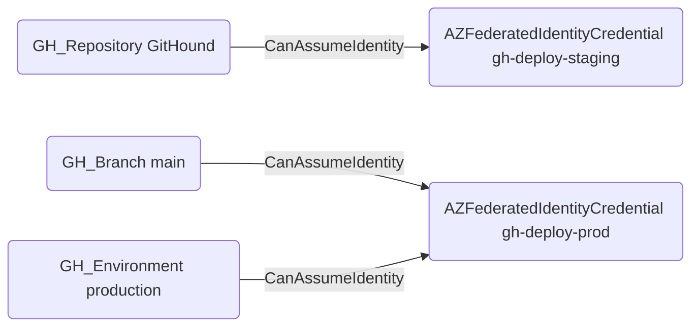

# CanAssumeIdentity

## Edge Schema

- Source: [GH_Repository](../Nodes/GH_Repository.md), [GH_Branch](../Nodes/GH_Branch.md), [GH_Environment](../Nodes/GH_Environment.md)
- Destination: [AZFederatedIdentityCredential](https://bloodhound.specterops.io/resources/nodes/az-federated-identity-credential)

## General Information

The traversable `CanAssumeIdentity` edge is a hybrid edge connecting GitHub OIDC token sources to Azure federated identity credentials. Created by the collector when matching GitHub OIDC subject claims to Azure workload identity federation configurations, this edge represents a verified path from GitHub Actions to Azure resource access. It is traversable because an attacker who can execute workflows in the source repository, branch, or environment can obtain an OIDC token that Azure will accept, granting access to the associated Azure workload identity and its permissions. This edge is critical for identifying cross-cloud lateral movement paths from GitHub into Azure.

