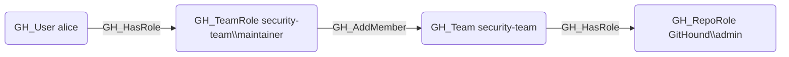

# GH_AddMember

## Edge Schema

- Source: [GH_TeamRole](../NodeDescriptions/GH_TeamRole.md)
- Destination: [GH_Team](../NodeDescriptions/GH_Team.md)

## General Information

The traversable [GH_AddMember](GH_AddMember.md) edge indicates that a team role with the Maintainer permission level can add new members to the team. It is created by `Git-HoundTeam` when enumerating team membership roles. This edge is traversable because the ability to add members grants indirect access -- a maintainer can add any user to the team, and that user then inherits all of the team's repository permissions, effectively expanding the attack surface.

