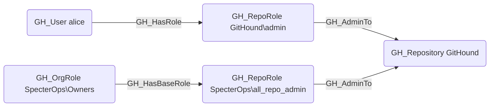

# GH_AdminTo

## Edge Schema

- Source: [GH_RepoRole](../NodeDescriptions/GH_RepoRole.md)
- Destination: [GH_Repository](../NodeDescriptions/GH_Repository.md)

## General Information

The non-traversable [GH_AdminTo](GH_AdminTo.md) edge represents a role's full administrative access to the repository. Admin is the highest built-in repository role and grants control over all repository settings, including dangerous operations like deleting the repository or modifying its visibility. Admin access bypasses most protections including branch protection rules, unless `enforce_admins` is explicitly enabled on the branch protection rule. This edge is a key permission in the computed branch access model and is a high-value target in attack path analysis.

