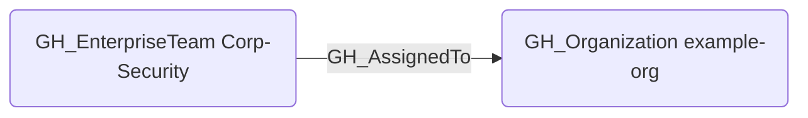

# GH_AssignedTo

## Edge Schema

- Source: [GH_EnterpriseTeam](../NodeDescriptions/GH_EnterpriseTeam.md)
- Destination: [GH_Organization](../NodeDescriptions/GH_Organization.md)

## General Information

The non-traversable [GH_AssignedTo](GH_AssignedTo.md) edge represents the structural assignment of an enterprise team to an organization. It is created from the enterprise team organization assignment API and indicates that GitHub projects the enterprise team into that organization. This edge is intentionally non-traversable because assignment alone does not grant privilege until the projected organization team is linked into repository or organization role paths.

