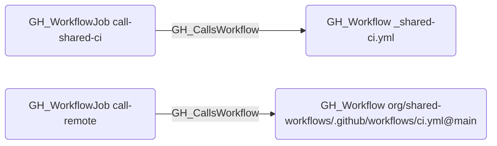

# GH_CallsWorkflow

## Edge Schema

- Source: [GH_WorkflowJob](../NodeDescriptions/GH_WorkflowJob.md)
- Destination: [GH_Workflow](../NodeDescriptions/GH_Workflow.md)

## General Information

The traversable [GH_CallsWorkflow](GH_CallsWorkflow.md) edge links a workflow job to a reusable workflow it invokes via the `uses:` key at the job level. Created during the integrated workflow-analysis step in `Invoke-GitHound`, this edge captures the reusable workflow call graph, enabling analysts to trace inherited permissions and secret access through called workflows.

### Local vs. remote reusable workflows

- **Local** (`./. github/workflows/_ci.yml`): the destination is matched by `name` against workflows in the same repository.
- **Remote** (`org/repo/.github/workflows/file.yml@ref`): the destination is matched by the full reference string. If the called workflow has not been collected, the edge destination will not resolve.

The `reusable_ref` property on the edge always contains the raw `uses:` value from the workflow file.

