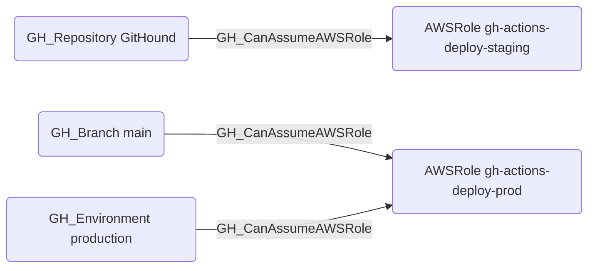

# GH_CanAssumeAWSRole

## Edge Schema

- Source: [GH_Repository](../Nodes/GH_Repository.md), [GH_Branch](../Nodes/GH_Branch.md), [GH_Environment](../Nodes/GH_Environment.md)
- Destination: [AWSRole](https://bloodhound.specterops.io/resources/nodes/aws-role)

## General Information

The traversable `GH_CanAssumeAWSRole` edge is a hybrid edge connecting GitHub OIDC token sources to AWS IAM roles configured for GitHub Actions federation. Created by the collector when matching GitHub OIDC subject claims to AWS role trust policies, this edge represents a verified path from GitHub Actions to AWS resource access. It is traversable because an attacker who can execute workflows in the source repository, branch, or environment can obtain an OIDC token that AWS STS will accept, granting temporary credentials for the associated IAM role. This edge is critical for identifying cross-cloud lateral movement paths from GitHub into AWS.

