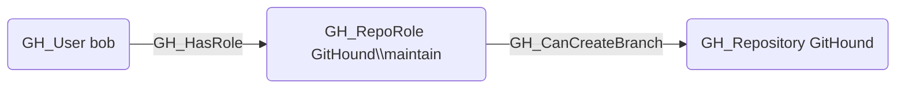

# GH_CanCreateBranch

## Edge Schema

- Source: [GH_RepoRole](../Nodes/GH_RepoRole.md), [GH_User](../Nodes/GH_User.md), [GH_Team](../Nodes/GH_Team.md)
- Destination: [GH_Repository](../Nodes/GH_Repository.md)

## General Information

The traversable `GH_CanCreateBranch` edge is a computed edge indicating that a role or actor can create new branches in a repository. Created by `Compute-GitHoundBranchAccess` with no additional API calls, the computation evaluates whether a wildcard (`*`) BPR with push restrictions and `blocks_creations` exists. If no such BPR exists, any write-capable role can create branches. If one exists, admin or `push_protected_branch` permission is required, or the actor must be listed in pushAllowances. Per-actor edges from [`GH_User`](../Nodes/GH_User.md) or [`GH_Team`](../Nodes/GH_Team.md) are only emitted when BPR allowances grant branch creation access beyond what the role provides. Each edge includes a `reason` property and a `query_composition` Cypher query showing the underlying graph evidence.

