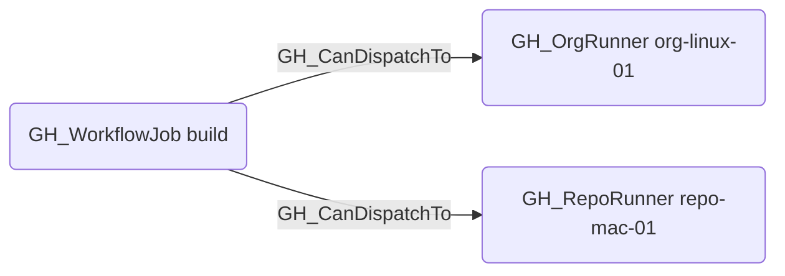

# GH_CanDispatchTo

## Edge Schema

- Source: [GH_WorkflowJob](../NodeDescriptions/GH_WorkflowJob.md)
- Destination: [GH_OrgRunner](../NodeDescriptions/GH_OrgRunner.md), [GH_RepoRunner](../NodeDescriptions/GH_RepoRunner.md)

## General Information

The non-traversable [GH_CanDispatchTo](GH_CanDispatchTo.md) edge indicates that a workflow job's `runs-on` declaration matches a specific self-hosted runner that the owning repository is already allowed to use. It is computed by `Get-WorkflowRunnerDispatchEdges` from three pieces of evidence:

- the job declares `self-hosted` in `runs_on`
- the repository has a [GH_CanUseRunner](GH_CanUseRunner.md) edge to the runner
- the runner's labels satisfy every requested `runs_on` label

This edge is intentionally non-traversable for now. It records scheduler eligibility and configuration evidence, but does not by itself prove a reliable exploit or control path to the runner.

