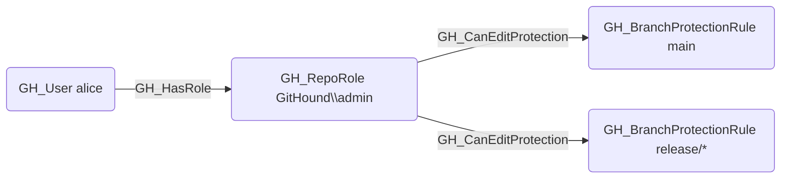

# GH_CanEditProtection

## Edge Schema

- Source: [GH_RepoRole](../Nodes/GH_RepoRole.md)
- Destination: [GH_BranchProtectionRule](../Nodes/GH_BranchProtectionRule.md)

## General Information

The non-traversable `GH_CanEditProtection` edge is a computed edge indicating that a role can modify or remove a branch protection rule. Created by `Compute-GitHoundBranchAccess` with no additional API calls, this edge is emitted when the role has `GH_EditRepoProtections` or `GH_AdminTo` permissions. It is non-traversable because modifying a BPR is a distinct action from pushing code — it represents an indirect bypass path rather than a direct code contribution path. An analyst combines this edge visually with other edges to identify that a role can both weaken branch protections and has write access to the repository, representing a compound risk.

