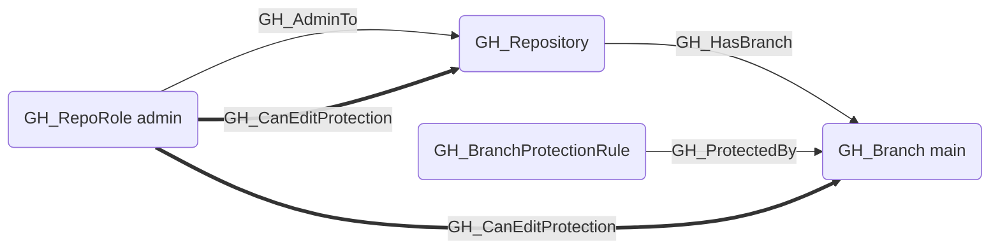
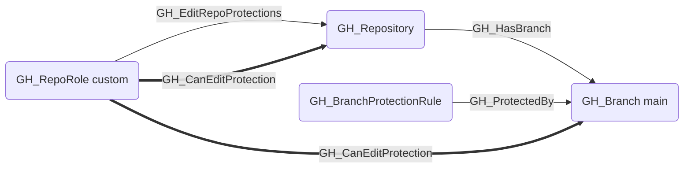

# GH_CanEditProtection

## Edge Schema

- Source: [GH_RepoRole](../NodeDescriptions/GH_RepoRole.md)
- Destination: [GH_Repository](../NodeDescriptions/GH_Repository.md), [GH_Branch](../NodeDescriptions/GH_Branch.md)

## General Information

The traversable [GH_CanEditProtection](GH_CanEditProtection.md) edge is a computed edge indicating that a role can modify or remove branch protection rules in a repository. Created by `Compute-GitHoundBranchAccess` with no additional API calls, this edge is emitted when the role has [GH_EditRepoProtections](GH_EditRepoProtections.md) or [GH_AdminTo](GH_AdminTo.md) permissions and the repository contains at least one protected branch. Repo-targeted edges model the repo-wide security impact for attack path traversal; branch-targeted edges are also emitted as supporting evidence for each protected branch governed by those rules.

## Scenarios

### `admin` — Admin can edit protections

The admin role has [GH_AdminTo](GH_AdminTo.md) which implicitly grants the ability to modify or remove any branch protection rule.

### `edit_repo_protections` — Explicit edit permission

A custom or standard role with the [GH_EditRepoProtections](GH_EditRepoProtections.md) permission can modify or remove branch protection rules.

