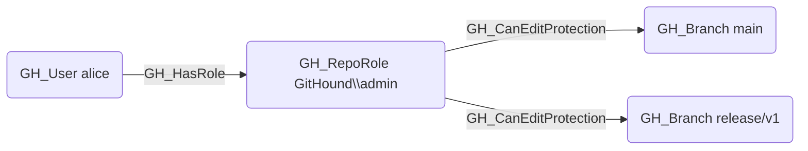

# GH_CanEditProtection

## Edge Schema

- Source: [GH_RepoRole](../Nodes/GH_RepoRole.md)
- Destination: [GH_Branch](../Nodes/GH_Branch.md)

## General Information

The traversable `GH_CanEditProtection` edge is a computed edge indicating that a role can modify or remove the branch protection rules governing a specific branch. Created by `Compute-GitHoundBranchAccess` with no additional API calls, this edge is emitted when the role has `GH_EditRepoProtections` or `GH_AdminTo` permissions and the branch is covered by at least one branch protection rule. The edge targets the protected branch (not the BPR itself) because the security impact is evaluated per-branch — a role that can weaken or remove protections on a branch can subsequently push code to it, representing a privilege escalation path.

