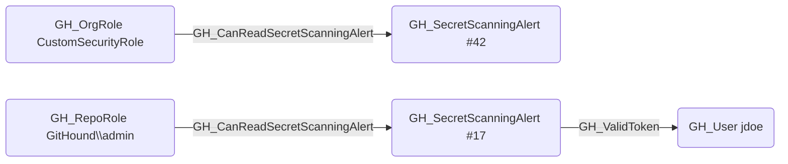

# GH_CanReadSecretScanningAlert

## Edge Schema

- Source: [GH_OrgRole](../Nodes/GH_OrgRole.md), [GH_RepoRole](../Nodes/GH_RepoRole.md)
- Destination: [GH_SecretScanningAlert](../Nodes/GH_SecretScanningAlert.md)

## General Information

The traversable `GH_CanReadSecretScanningAlert` edge is a computed edge indicating that a role can read a specific secret scanning alert, including the leaked secret value. Created by `Compute-GitHoundSecretScanningAccess` with no additional API calls, the computation cross-references `GH_ViewSecretScanningAlerts` permission edges with structural edges (`GH_Contains` for org-level, `GH_HasSecretScanningAlert` for repo-level) to determine which alerts each role can access. This edge is traversable because reading an alert reveals the leaked secret — if the secret is a valid GitHub Personal Access Token, the `GH_ValidToken` edge enables identity compromise of the token's owner.

Each edge includes a `reason` property (`org_role_permission` or `repo_role_permission`) and a `query_composition` Cypher query showing the underlying graph evidence.

