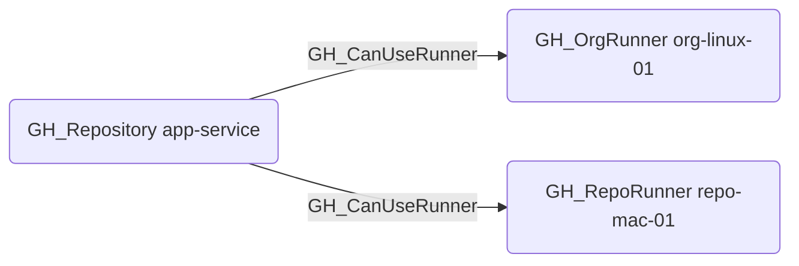

# GH_CanUseRunner

## Edge Schema

- Source: [GH_Repository](../NodeDescriptions/GH_Repository.md)
- Destination: [GH_OrgRunner](../NodeDescriptions/GH_OrgRunner.md), [GH_RepoRunner](../NodeDescriptions/GH_RepoRunner.md)

## General Information

The non-traversable [GH_CanUseRunner](GH_CanUseRunner.md) edge indicates that a repository can dispatch GitHub Actions jobs to a specific self-hosted runner. It is created by `Git-HoundRunner` from either repository-scoped runner registration or organization runner-group access resolution. The destination runner node will be either [GH_OrgRunner](../NodeDescriptions/GH_OrgRunner.md) or [GH_RepoRunner](../NodeDescriptions/GH_RepoRunner.md).

This edge is intentionally non-traversable for now. It captures repository-level runner access policy rather than a fully proven execution or compromise path.

This edge is traversable because a principal that can execute arbitrary workflow code in the repository can cause that code to run on the target runner, making the runner a meaningful execution and lateral movement target in attack-path analysis.

