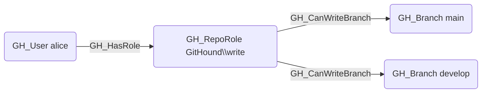

# GH_CanWriteBranch

## Edge Schema

- Source: [GH_RepoRole](../Nodes/GH_RepoRole.md), [GH_User](../Nodes/GH_User.md), [GH_Team](../Nodes/GH_Team.md)
- Destination: [GH_Branch](../Nodes/GH_Branch.md)

## General Information

The traversable `GH_CanWriteBranch` edge is a computed edge indicating that a role or actor can push to a specific branch. Created by `Compute-GitHoundBranchAccess` with no additional API calls, the computation evaluates both the merge gate (PR review requirements) and push gate (push restrictions) of any branch protection rule protecting the branch. Role-level edges are the common case; per-actor edges from `GH_User` or `GH_Team` are only emitted when BPR allowances grant access beyond what the role provides. Each edge includes a `reason` property (`no_protection`, `admin`, `push_protected_branch`, `bypass_branch_protection`, `push_allowance`, `bypass_pr_allowance`) and a `query_composition` Cypher query showing the underlying graph evidence.

