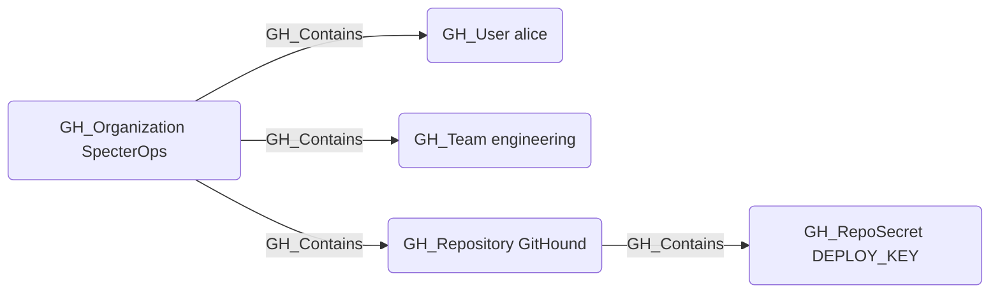

# GH_Contains

## Edge Schema

- Source: [GH_Organization](../Nodes/GH_Organization.md), [GH_Repository](../Nodes/GH_Repository.md), [GH_Environment](../Nodes/GH_Environment.md)
- Destination: [GH_User](../Nodes/GH_User.md), [GH_Team](../Nodes/GH_Team.md), [GH_Repository](../Nodes/GH_Repository.md), [GH_OrgRole](../Nodes/GH_OrgRole.md), [GH_RepoRole](../Nodes/GH_RepoRole.md), [GH_TeamRole](../Nodes/GH_TeamRole.md), [GH_OrgSecret](../Nodes/GH_OrgSecret.md), [GH_AppInstallation](../Nodes/GH_AppInstallation.md), [GH_PersonalAccessToken](../Nodes/GH_PersonalAccessToken.md), [GH_PersonalAccessTokenRequest](../Nodes/GH_PersonalAccessTokenRequest.md), [GH_RepoSecret](../Nodes/GH_RepoSecret.md), [GH_EnvironmentSecret](../Nodes/GH_EnvironmentSecret.md), [GH_SecretScanningAlert](../Nodes/GH_SecretScanningAlert.md)

## General Information

The non-traversable `GH_Contains` edge represents structural containment within the GitHub resource hierarchy. The organization serves as the top-level container for users, teams, repositories, roles, secrets, app installations, and personal access tokens. Repositories contain their own repo-level secrets, and environments contain environment-scoped secrets. This edge is created by the collector to establish the organizational hierarchy of GitHub resources and is not traversable because containment alone does not imply privilege escalation.

