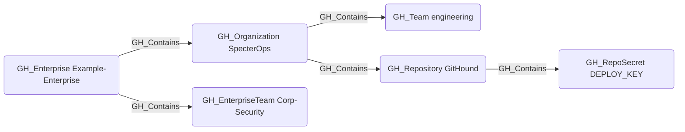

# GH_Contains

## Edge Schema

- Source: [GH_Enterprise](../NodeDescriptions/GH_Enterprise.md), [GH_Organization](../NodeDescriptions/GH_Organization.md), [GH_Repository](../NodeDescriptions/GH_Repository.md), [GH_Environment](../NodeDescriptions/GH_Environment.md)
- Destination: [GH_Organization](../NodeDescriptions/GH_Organization.md), [GH_EnterpriseTeam](../NodeDescriptions/GH_EnterpriseTeam.md), [GH_Team](../NodeDescriptions/GH_Team.md), [GH_Repository](../NodeDescriptions/GH_Repository.md), [GH_OrgRole](../NodeDescriptions/GH_OrgRole.md), [GH_RepoRole](../NodeDescriptions/GH_RepoRole.md), [GH_TeamRole](../NodeDescriptions/GH_TeamRole.md), [GH_OrgSecret](../NodeDescriptions/GH_OrgSecret.md), [GH_AppInstallation](../NodeDescriptions/GH_AppInstallation.md), [GH_PersonalAccessToken](../NodeDescriptions/GH_PersonalAccessToken.md), [GH_PersonalAccessTokenRequest](../NodeDescriptions/GH_PersonalAccessTokenRequest.md), [GH_RepoSecret](../NodeDescriptions/GH_RepoSecret.md), [GH_EnvironmentSecret](../NodeDescriptions/GH_EnvironmentSecret.md), [GH_SecretScanningAlert](../NodeDescriptions/GH_SecretScanningAlert.md)

## General Information

The non-traversable [GH_Contains](GH_Contains.md) edge represents structural containment within the GitHub resource hierarchy. At the top of that hierarchy, a `GH_Enterprise` contains its member organizations and enterprise teams. An organization contains teams, repositories, roles, secrets, app installations, and personal access tokens. Repositories contain their own repo-level secrets, and environments contain environment-scoped secrets. Principal membership is modeled separately through [GH_HasMember](GH_HasMember.md), and enterprise-team deployment into organizations is modeled with [GH_AssignedTo](GH_AssignedTo.md) rather than `GH_Contains`. This edge is created by the collector to establish the organizational hierarchy of GitHub resources and is not traversable because containment alone does not imply privilege escalation.

