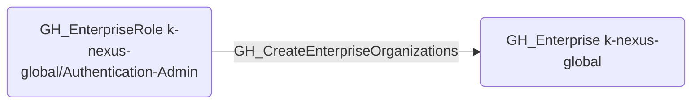

# GH_CreateEnterpriseOrganizations

## Edge Schema

- Source: [GH_EnterpriseRole](../NodeDescriptions/GH_EnterpriseRole.md)
- Destination: [GH_Enterprise](../NodeDescriptions/GH_Enterprise.md)

## General Information

The non-traversable [GH_CreateEnterpriseOrganizations](GH_CreateEnterpriseOrganizations.md) edge represents that a custom enterprise role has the ability to create new organizations within the enterprise. This edge is dynamically generated from custom enterprise role permissions discovered by the collector. Creating organizations expands the enterprise's attack surface and could be used to establish shadow infrastructure for lateral movement or data staging.

