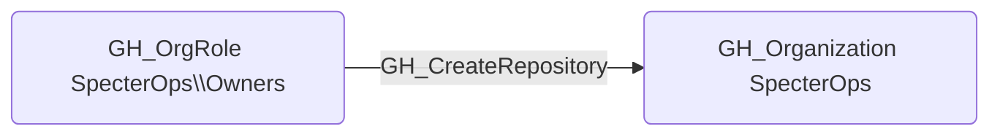

# GH_CreateRepository

## Edge Schema

- Source: [GH_OrgRole](../NodeDescriptions/GH_OrgRole.md)
- Destination: [GH_Organization](../NodeDescriptions/GH_Organization.md)

## General Information

The non-traversable [GH_CreateRepository](GH_CreateRepository.md) edge represents that a role has the ability to create new repositories within the organization. This permission is available to Owners and custom organization roles that have been granted the repository creation permission. Creating repositories can introduce new attack surface to an organization, as each new repository is a potential vector for code execution through GitHub Actions workflows, secret exposure, and supply chain attacks.

