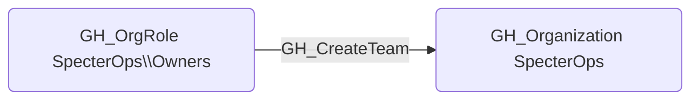

# GH_CreateTeam

## Edge Schema

- Source: [GH_OrgRole](../NodeDescriptions/GH_OrgRole.md)
- Destination: [GH_Organization](../NodeDescriptions/GH_Organization.md)

## General Information

The non-traversable [GH_CreateTeam](GH_CreateTeam.md) edge represents that a role has the ability to create teams within the organization. Teams are the primary mechanism for granting groups of users access to repositories, so team creation is a stepping stone to broader access. This edge is created by the collector when enumerating organization role permissions, and its security significance lies in the fact that a newly created team can be granted repository access and then populated with controlled accounts.

