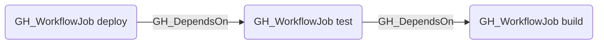

# GH_DependsOn

## Edge Schema

- Source: [GH_WorkflowJob](../NodeDescriptions/GH_WorkflowJob.md)
- Destination: [GH_WorkflowJob](../NodeDescriptions/GH_WorkflowJob.md)

## General Information

The non-traversable [GH_DependsOn](GH_DependsOn.md) edge represents a `needs:` dependency between two jobs in the same workflow. Created during the integrated workflow-analysis step in `Invoke-GitHound`, this edge captures execution order constraints — the source job will not start until the destination job completes successfully. This edge is non-traversable because it represents sequencing only, not an access or privilege path.

