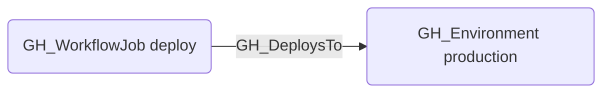

# GH_DeploysTo

## Edge Schema

- Source: [GH_WorkflowJob](../NodeDescriptions/GH_WorkflowJob.md)
- Destination: [GH_Environment](../NodeDescriptions/GH_Environment.md)

## General Information

The traversable [GH_DeploysTo](GH_DeploysTo.md) edge links a workflow job to the GitHub Environment it targets via the `environment:` key. Created by `Parse-GitHoundWorkflow`, this edge is significant because environments can gate deployments with protection rules (required reviewers, wait timers, deployment branch policies) and can expose environment-scoped secrets. An attacker who can trigger or manipulate a workflow job may be able to reach environment secrets through this path.

