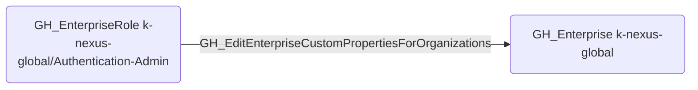

# GH_EditEnterpriseCustomPropertiesForOrganizations

## Edge Schema

- Source: [GH_EnterpriseRole](../NodeDescriptions/GH_EnterpriseRole.md)
- Destination: [GH_Enterprise](../NodeDescriptions/GH_Enterprise.md)

## General Information

The non-traversable [GH_EditEnterpriseCustomPropertiesForOrganizations](GH_EditEnterpriseCustomPropertiesForOrganizations.md) edge represents that a custom enterprise role can edit custom properties defined for organizations within the enterprise. This edge is dynamically generated from custom enterprise role permissions discovered by the collector. Custom properties are used to classify and manage organizations, and modifying them could affect policy enforcement or automation that depends on property values.

