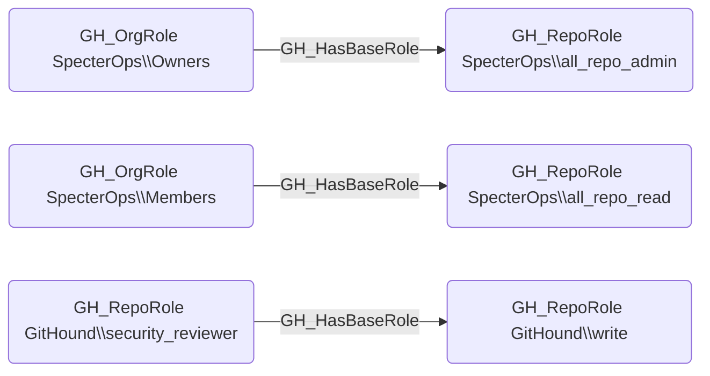

# GH_HasBaseRole

## Edge Schema

- Source: [GH_OrgRole](../Nodes/GH_OrgRole.md), [GH_RepoRole](../Nodes/GH_RepoRole.md)
- Destination: [GH_OrgRole](../Nodes/GH_OrgRole.md), [GH_RepoRole](../Nodes/GH_RepoRole.md)

## General Information

The traversable `GH_HasBaseRole` edge represents role inheritance within the GitHub permission hierarchy. Org roles inherit down to all-repo roles (e.g., Owners inherits to all_repo_admin), and custom roles inherit from their base roles (e.g., a custom_role inherits from write). It is created by `Git-HoundOrganization` (for org-to-repo role inheritance) and `Git-HoundRepository` (for repo-level role inheritance). This edge is traversable because it extends permissions through the role hierarchy, meaning a principal with a higher-level role implicitly holds all inherited lower-level roles.

