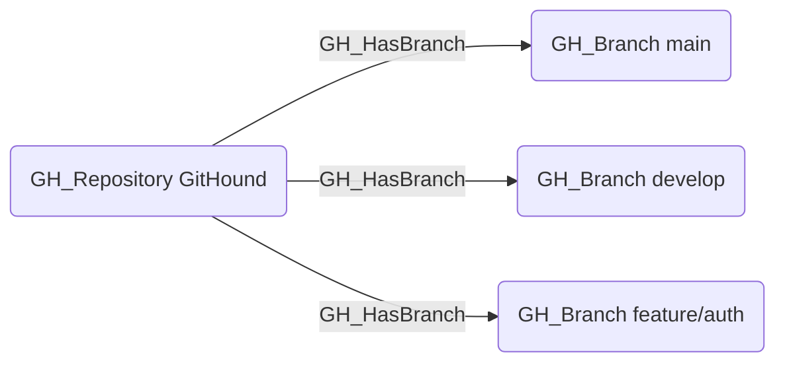

# GH_HasBranch

## Edge Schema

- Source: [GH_Repository](../NodeDescriptions/GH_Repository.md)
- Destination: [GH_Branch](../NodeDescriptions/GH_Branch.md)

## General Information

The non-traversable [GH_HasBranch](GH_HasBranch.md) edge represents the relationship between a repository and its branches. Created by `Git-HoundBranch`, this edge links each collected branch to its parent repository. It is a structural edge that provides the foundation for understanding branch-level protections and access controls. While not traversable itself, it connects repositories to branches where traversable edges like [GH_CanWriteBranch](GH_CanWriteBranch.md) and [GH_CanEditProtection](GH_CanEditProtection.md) model the effective access.

