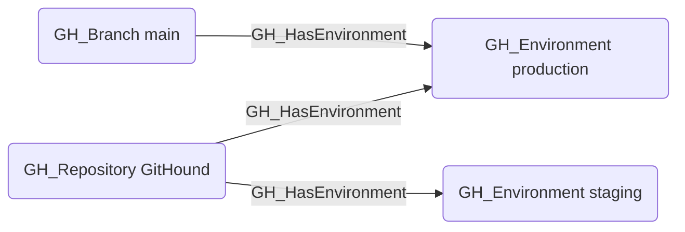

# GH_HasEnvironment

## Edge Schema

- Source: [GH_Repository](../Nodes/GH_Repository.md), [GH_Branch](../Nodes/GH_Branch.md)
- Destination: [GH_Environment](../Nodes/GH_Environment.md)

## General Information

The non-traversable `GH_HasEnvironment` edge represents the relationship between a repository or branch and its deployment environments. Created by `Git-HoundEnvironment`, this edge links environments to the repositories that define them and to the branches that are allowed to deploy to them (via deployment branch policies). Environments are security-relevant because they can gate access to secrets and cloud credentials, and their deployment branch policies control which branches can trigger deployments.

