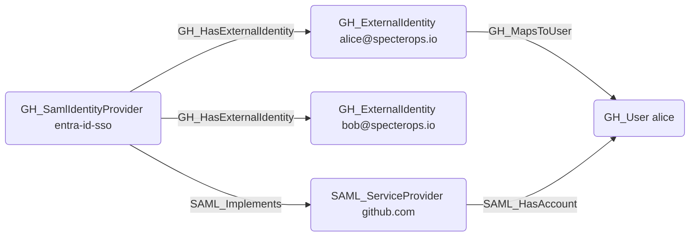

# GH_HasExternalIdentity

## Edge Schema

- Source: [GH_SamlIdentityProvider](../NodeDescriptions/GH_SamlIdentityProvider.md)
- Destination: [GH_ExternalIdentity](../NodeDescriptions/GH_ExternalIdentity.md)

## General Information

The non-traversable [GH_HasExternalIdentity](GH_HasExternalIdentity.md) edge represents the relationship between a SAML identity provider and the external identities (SSO users) it manages. Created by `Git-HoundGraphQlSamlProvider` and `Git-HoundEnterpriseSamlProvider`, this edge links each external identity to the SAML provider that authenticated it. External identities are a key component in cross-platform attack path analysis because they bridge the gap between corporate identity providers and GitHub user accounts via the [GH_MapsToUser](GH_MapsToUser.md) edge. Enumerating external identities reveals which corporate users have linked GitHub accounts and enables mapping from IdP compromise to GitHub access.

In the hybrid SAML layer, this edge also participates in the derivation of `SAML_HasAccount`. When the same provider is normalized to `SAML_ServiceProvider` through `SAML_Implements`, GitHound combines `GH_HasExternalIdentity` with `GH_MapsToUser` to emit `SAML_ServiceProvider -[:SAML_HasAccount]-> GH_User`.

