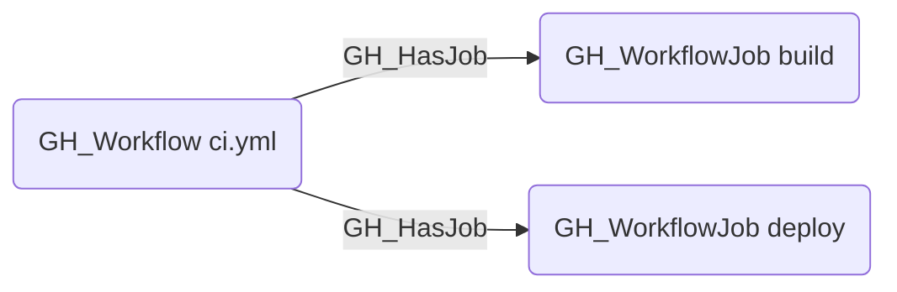

# GH_HasJob

## Edge Schema

- Source: [GH_Workflow](../NodeDescriptions/GH_Workflow.md)
- Destination: [GH_WorkflowJob](../NodeDescriptions/GH_WorkflowJob.md)

## General Information

The traversable [GH_HasJob](GH_HasJob.md) edge links a workflow to each of its jobs. Created during the integrated workflow-analysis step in `Invoke-GitHound`, this edge is the primary structural link for walking from a workflow definition into its execution units. Because jobs can declare environments and permissions, traversing this edge enables analysts to reason about what a workflow can do and where it can deploy.

