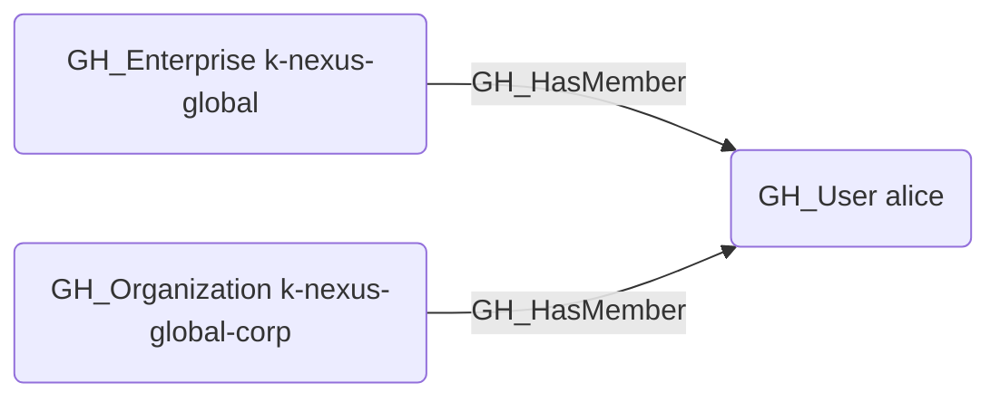

# GH_HasMember

## Edge Schema

- Source: [GH_Enterprise](../NodeDescriptions/GH_Enterprise.md), [GH_Organization](../NodeDescriptions/GH_Organization.md)
- Destination: [GH_User](../NodeDescriptions/GH_User.md)

## General Information

The non-traversable [GH_HasMember](GH_HasMember.md) edge represents direct membership of a user in an enterprise or organization. This edge is distinct from role assignment edges (GH_HasRole) -- membership indicates that the user belongs to the entity, while roles define what permissions the user has within it.

At the enterprise level, this edge is created by `Git-HoundEnterpriseUser` using the GraphQL `enterprise.members` connection. At the organization level, this edge is created by `Git-HoundUser` alongside the existing role assignment edges.

