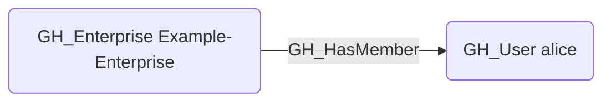

# GH_HasMember

## Edge Schema

- Source: [GH_Enterprise](../NodeDescriptions/GH_Enterprise.md), [GH_Organization](../NodeDescriptions/GH_Organization.md)
- Destination: [GH_User](../NodeDescriptions/GH_User.md)

## General Information

The non-traversable [GH_HasMember](GH_HasMember.md) edge represents direct membership of a user in an enterprise or organization. This edge is structural and identity-oriented rather than privilege-bearing: it shows that the user belongs to the scope, but it does not by itself grant any permissions.

At the enterprise level, this edge is created by `Git-HoundEnterpriseUser` from the GraphQL `enterprise.members` connection. Organization-level membership remains primarily modeled through default organization roles today, but `GH_HasMember` is the appropriate semantic edge when direct membership is collected as first-class data.

