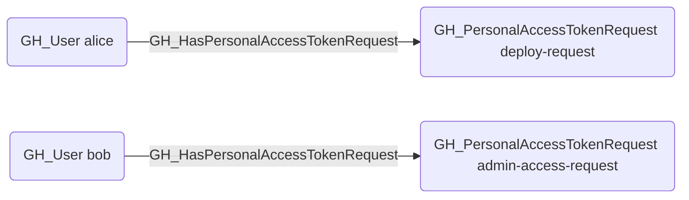

# GH_HasPersonalAccessTokenRequest

## Edge Schema

- Source: [GH_User](../NodeDescriptions/GH_User.md)
- Destination: [GH_PersonalAccessTokenRequest](../NodeDescriptions/GH_PersonalAccessTokenRequest.md)

## General Information

The non-traversable [GH_HasPersonalAccessTokenRequest](GH_HasPersonalAccessTokenRequest.md) edge represents the relationship between a user and their pending personal access token requests awaiting organizational approval. Created by `Git-HoundPersonalAccessTokenRequest`, this edge links each pending token request back to the user who submitted it. Pending token requests are security-relevant because they represent access that may soon be granted, and reviewing them helps administrators understand what permissions users are requesting before approval. Organizations that require approval for fine-grained PATs will have these requests queued until an administrator acts on them.

