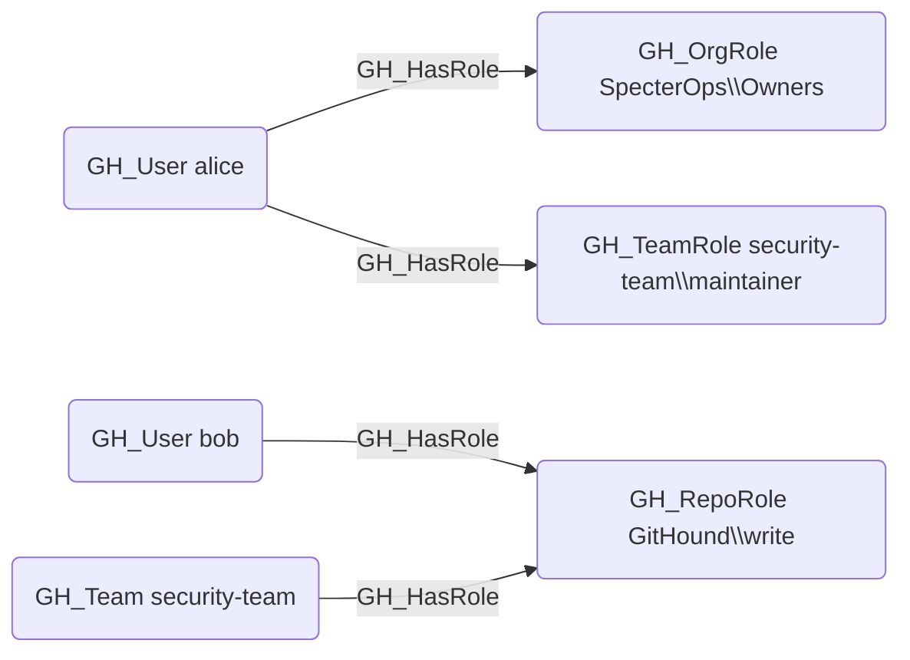

# GH_HasRole

## Edge Schema

- Source: [GH_User](../NodeDescriptions/GH_User.md), [GH_Team](../NodeDescriptions/GH_Team.md)
- Destination: [GH_OrgRole](../NodeDescriptions/GH_OrgRole.md), [GH_RepoRole](../NodeDescriptions/GH_RepoRole.md), [GH_TeamRole](../NodeDescriptions/GH_TeamRole.md)

## General Information

The traversable [GH_HasRole](GH_HasRole.md) edge represents the assignment of a user or team to a specific role within the organization, repository, or team. This is the primary edge for connecting identities to their permissions and serves as the foundation of all access paths in the GitHub permission model. It is created by `Git-HoundUser` (for org roles), `Git-HoundRepositoryRole` (for repo roles), and `Git-HoundTeam` (for team roles). Because role assignment is the starting point for determining what a principal can do, this edge is traversable and critical for attack path analysis.

