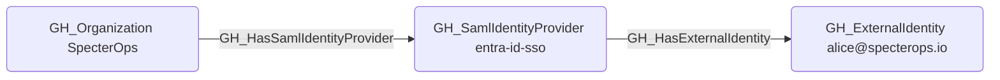

# GH_HasSamlIdentityProvider

## Edge Schema

- Source: [GH_Organization](../NodeDescriptions/GH_Organization.md)
- Destination: [GH_SamlIdentityProvider](../NodeDescriptions/GH_SamlIdentityProvider.md)

## General Information

The non-traversable [GH_HasSamlIdentityProvider](GH_HasSamlIdentityProvider.md) edge represents the relationship between an organization and its SAML identity provider configuration. Created by `Git-HoundGraphQlSamlProvider`, this edge links an organization to the SAML SSO provider used for authentication and user provisioning. SAML identity providers are a critical security component because they establish the trust boundary between an external identity provider (such as Entra ID or Okta) and the GitHub organization. Understanding this relationship is essential for mapping cross-platform attack paths where compromise of the identity provider could lead to access within the GitHub organization.

