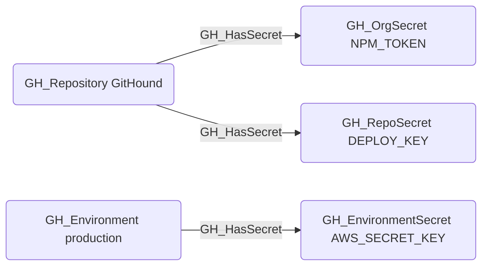

# GH_HasSecret

## Edge Schema

- Source: [GH_Repository](../Nodes/GH_Repository.md), [GH_Environment](../Nodes/GH_Environment.md)
- Destination: [GH_OrgSecret](../Nodes/GH_OrgSecret.md), [GH_RepoSecret](../Nodes/GH_RepoSecret.md), [GH_EnvironmentSecret](../Nodes/GH_EnvironmentSecret.md)

## General Information

The non-traversable `GH_HasSecret` edge represents the relationship between a repository or environment and the secrets accessible within that context. Created by `Git-HoundOrganizationSecret`, `Git-HoundSecret`, and `Git-HoundEnvironment`, this edge shows which secrets are available in which scopes. Repositories can have access to both organization-level secrets (scoped to selected repositories) and repository-level secrets, while environments contain their own environment-scoped secrets. Understanding secret accessibility is critical for assessing the blast radius of a compromised workflow or environment.

