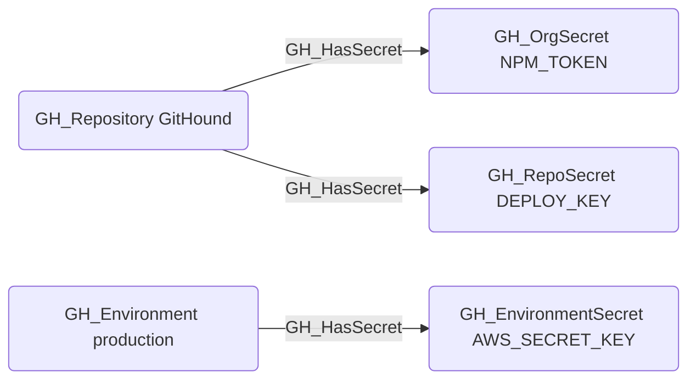

# GH_HasSecret

## Edge Schema

- Source: [GH_Repository](../NodeDescriptions/GH_Repository.md), [GH_Environment](../NodeDescriptions/GH_Environment.md)
- Destination: [GH_OrgSecret](../NodeDescriptions/GH_OrgSecret.md), [GH_RepoSecret](../NodeDescriptions/GH_RepoSecret.md), [GH_EnvironmentSecret](../NodeDescriptions/GH_EnvironmentSecret.md)

## General Information

The traversable [GH_HasSecret](GH_HasSecret.md) edge represents the relationship between a repository or environment and the secrets accessible within that context. Created by `Git-HoundOrganizationSecret`, `Git-HoundSecret`, and `Git-HoundEnvironment`, this edge shows which secrets are available in which scopes. Repositories can have access to both organization-level secrets (scoped to selected repositories) and repository-level secrets, while environments contain their own environment-scoped secrets. This edge is traversable because any principal that can push code to a repository (via [GH_CanWriteBranch](GH_CanWriteBranch.md) or [GH_CanCreateBranch](GH_CanCreateBranch.md)) can write a workflow that exfiltrates the secret values at runtime, making this a meaningful link in attack path analysis.

