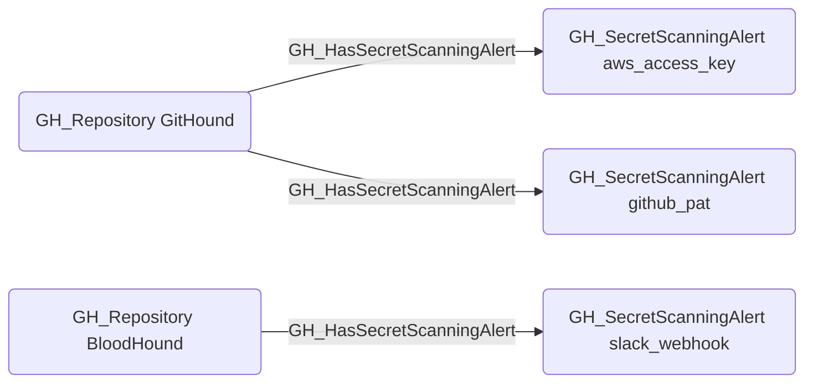

# GH_HasSecretScanningAlert

## Edge Schema

- Source: [GH_Repository](../Nodes/GH_Repository.md)
- Destination: [GH_SecretScanningAlert](../Nodes/GH_SecretScanningAlert.md)

## General Information

The non-traversable `GH_HasSecretScanningAlert` edge represents the relationship between a repository and the secret scanning alerts found in its codebase. Created by `Git-HoundSecretScanningAlert`, this edge links each detected secret (such as exposed API keys, tokens, or credentials) to the repository where it was found. Secret scanning alerts are a high-value indicator of potential credential exposure and are essential for identifying repositories that may have leaked sensitive material. This edge enables analysts to quickly identify which repositories have active alerts requiring remediation.

