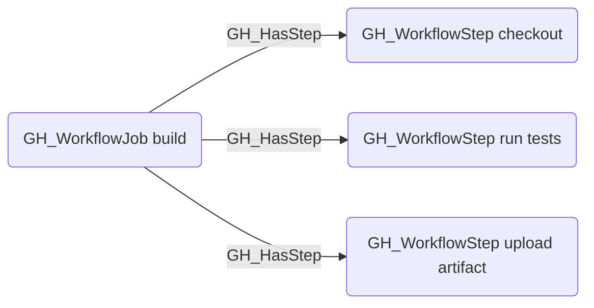

# GH_HasStep

## Edge Schema

- Source: [GH_WorkflowJob](../NodeDescriptions/GH_WorkflowJob.md)
- Destination: [GH_WorkflowStep](../NodeDescriptions/GH_WorkflowStep.md)

## General Information

The traversable [GH_HasStep](GH_HasStep.md) edge links a job to each of its steps in execution order. Created by `Parse-GitHoundWorkflow`, this edge enables analysts to enumerate all actions and shell commands executed by a job, including which secrets and variables each step consumes.

