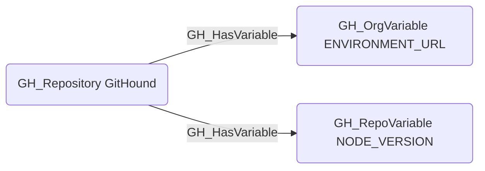

# GH_HasVariable

## Edge Schema

- Source: [GH_Repository](../Nodes/GH_Repository.md)
- Destination: [GH_OrgVariable](../Nodes/GH_OrgVariable.md), [GH_RepoVariable](../Nodes/GH_RepoVariable.md)

## General Information

The non-traversable `GH_HasVariable` edge represents the relationship between a repository and the variables accessible within that context. Created by `Git-HoundOrganizationSecret` and `Git-HoundVariable`, this edge shows which variables are available in which scopes. Repositories can have access to both organization-level variables (scoped by visibility to all, private, or selected repositories) and repository-level variables defined directly on the repo. Unlike secrets, variables contain non-sensitive configuration values whose plaintext values are readable via the API, making this edge non-traversable.

