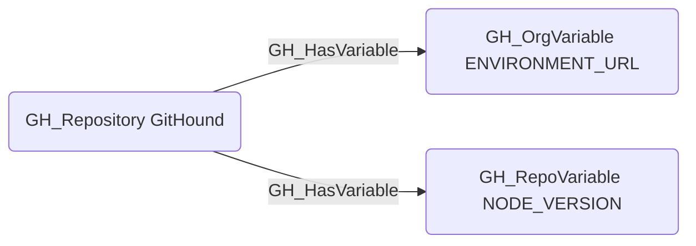

# GH_HasVariable

## Edge Schema

- Source: [GH_Repository](../NodeDescriptions/GH_Repository.md)
- Destination: [GH_OrgVariable](../NodeDescriptions/GH_OrgVariable.md), [GH_RepoVariable](../NodeDescriptions/GH_RepoVariable.md)

## General Information

The traversable [GH_HasVariable](GH_HasVariable.md) edge represents the relationship between a repository and the variables accessible within that context. Created by `Git-HoundOrganizationSecret` and `Git-HoundVariable`, this edge shows which variables are available in which scopes. Repositories can have access to both organization-level variables (scoped by visibility to all, private, or selected repositories) and repository-level variables defined directly on the repo. This edge is traversable because any principal that can push code to a repository (via [GH_CanWriteBranch](GH_CanWriteBranch.md) or [GH_CanCreateBranch](GH_CanCreateBranch.md)) can write a workflow that reads variable values at runtime, and variables may contain configuration data useful for lateral movement such as deployment URLs, service names, or environment identifiers.

