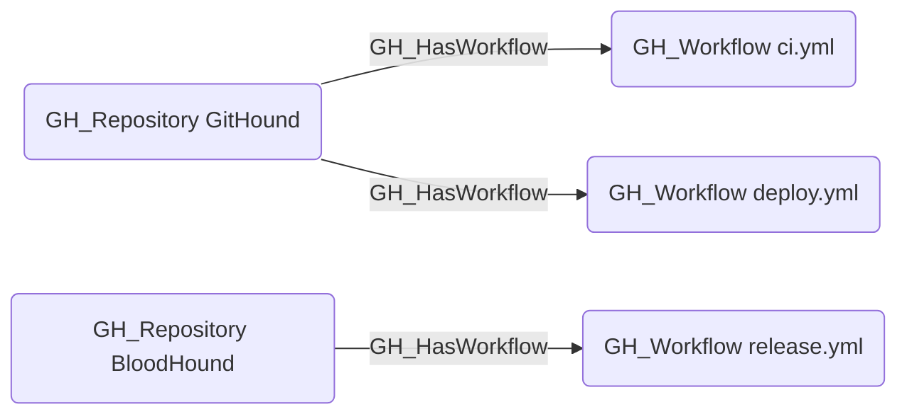

# GH_HasWorkflow

## Edge Schema

- Source: [GH_Repository](../NodeDescriptions/GH_Repository.md)
- Destination: [GH_Workflow](../NodeDescriptions/GH_Workflow.md)

## General Information

The non-traversable [GH_HasWorkflow](GH_HasWorkflow.md) edge represents the relationship between a repository and its GitHub Actions workflows. Created by `Git-HoundWorkflow`, this edge links each discovered workflow definition to its parent repository. Workflows are significant from a security perspective because they can execute arbitrary code with repository permissions, access secrets, and assume cloud identities. This structural edge enables analysts to enumerate which workflows exist in a given repository.

