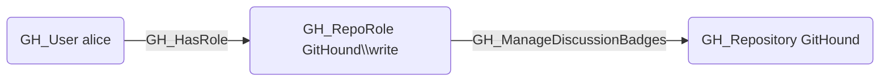

# GH_ManageDiscussionBadges

## Edge Schema

- Source: [GH_RepoRole](../Nodes/GH_RepoRole.md)
- Destination: [GH_Repository](../Nodes/GH_Repository.md)

## General Information

The non-traversable `GH_ManageDiscussionBadges` edge represents a role's ability to manage discussion badges used to highlight discussion participants. This permission is available to Write, Maintain, and Admin roles and custom roles that have been granted this specific permission.

