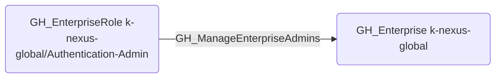

# GH_ManageEnterpriseAdmins

## Edge Schema

- Source: [GH_EnterpriseRole](../NodeDescriptions/GH_EnterpriseRole.md)
- Destination: [GH_Enterprise](../NodeDescriptions/GH_Enterprise.md)

## General Information

The traversable [GH_ManageEnterpriseAdmins](GH_ManageEnterpriseAdmins.md) edge represents that a custom enterprise role can manage enterprise administrators. This edge is dynamically generated from custom enterprise role permissions discovered by the collector. This is a high-impact permission -- an attacker with this capability can promote themselves or other compromised accounts to enterprise owner, granting full control over all organizations, repositories, and settings within the enterprise.

