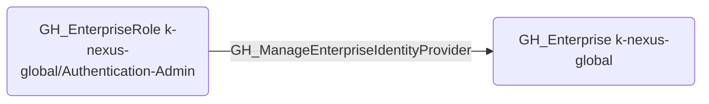

# GH_ManageEnterpriseIdentityProvider

## Edge Schema

- Source: [GH_EnterpriseRole](../NodeDescriptions/GH_EnterpriseRole.md)
- Destination: [GH_Enterprise](../NodeDescriptions/GH_Enterprise.md)

## General Information

The non-traversable [GH_ManageEnterpriseIdentityProvider](GH_ManageEnterpriseIdentityProvider.md) edge represents that a custom enterprise role can manage the enterprise's SAML identity provider configuration. This edge is dynamically generated from custom enterprise role permissions discovered by the collector. Modifying the identity provider settings could allow an attacker to redirect SAML authentication to an attacker-controlled IdP, enabling account takeover of any enterprise member.

