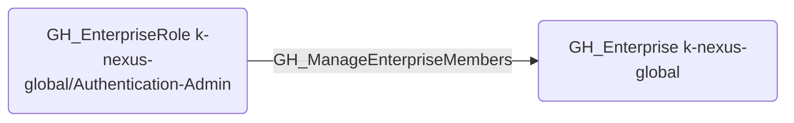

# GH_ManageEnterpriseMembers

## Edge Schema

- Source: [GH_EnterpriseRole](../NodeDescriptions/GH_EnterpriseRole.md)
- Destination: [GH_Enterprise](../NodeDescriptions/GH_Enterprise.md)

## General Information

The traversable [GH_ManageEnterpriseMembers](GH_ManageEnterpriseMembers.md) edge represents that a custom enterprise role can manage enterprise membership. This edge is dynamically generated from custom enterprise role permissions discovered by the collector. This permission allows inviting, removing, and managing enterprise members, which could be used to add attacker-controlled accounts or remove legitimate members to disrupt operations.

