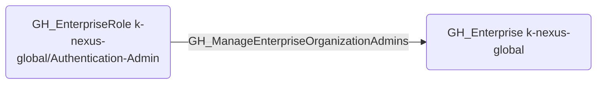

# GH_ManageEnterpriseOrganizationAdmins

## Edge Schema

- Source: [GH_EnterpriseRole](../NodeDescriptions/GH_EnterpriseRole.md)
- Destination: [GH_Enterprise](../NodeDescriptions/GH_Enterprise.md)

## General Information

The traversable [GH_ManageEnterpriseOrganizationAdmins](GH_ManageEnterpriseOrganizationAdmins.md) edge represents that a custom enterprise role can manage organization administrators across the enterprise. This edge is dynamically generated from custom enterprise role permissions discovered by the collector. This permission enables promoting or demoting organization owners, providing a privilege escalation path from enterprise role holder to organization admin across any organization in the enterprise.

