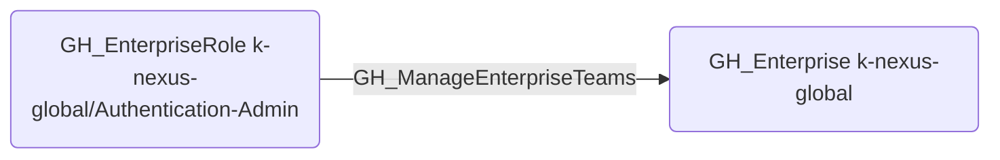

# GH_ManageEnterpriseTeams

## Edge Schema

- Source: [GH_EnterpriseRole](../NodeDescriptions/GH_EnterpriseRole.md)
- Destination: [GH_Enterprise](../NodeDescriptions/GH_Enterprise.md)

## General Information

The non-traversable [GH_ManageEnterpriseTeams](GH_ManageEnterpriseTeams.md) edge represents that a custom enterprise role can manage enterprise teams. This edge is dynamically generated from custom enterprise role permissions discovered by the collector. Enterprise teams can be assigned to custom enterprise roles and mapped to organization-level teams, so managing them could affect role assignments and organization access.

