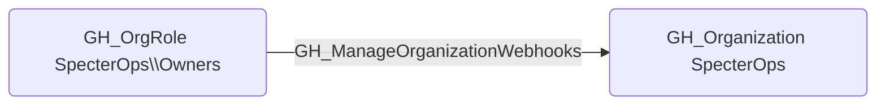

# GH_ManageOrganizationWebhooks

## Edge Schema

- Source: [GH_OrgRole](../Nodes/GH_OrgRole.md)
- Destination: [GH_Organization](../Nodes/GH_Organization.md)

## General Information

The non-traversable `GH_ManageOrganizationWebhooks` edge represents that a role has the ability to manage organization-level webhooks. This edge is dynamically generated from custom organization role permissions discovered by the collector. Webhooks can be configured to send event data to external endpoints, making this permission significant for security because an attacker could create or modify webhooks to exfiltrate repository data, commit contents, or issue details to an attacker-controlled server, or use them as a persistence mechanism.

