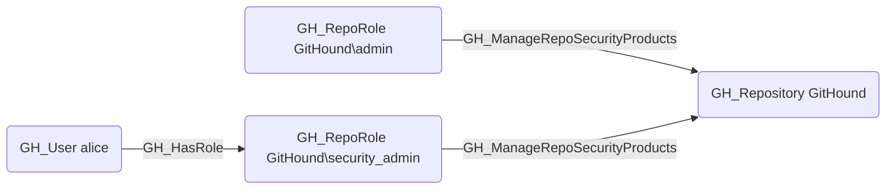

# GH_ManageRepoSecurityProducts

## Edge Schema

- Source: [GH_RepoRole](../NodeDescriptions/GH_RepoRole.md)
- Destination: [GH_Repository](../NodeDescriptions/GH_Repository.md)

## General Information

The non-traversable [GH_ManageRepoSecurityProducts](GH_ManageRepoSecurityProducts.md) edge represents a role's ability to manage repository-specific security product settings. This permission is available to Admin roles and custom roles that have been granted this specific permission. Unlike the broader [GH_ManageSecurityProducts](GH_ManageSecurityProducts.md) permission, this edge is scoped to repository-level security configuration such as repository-specific scanning settings and alert management. Disabling repository-level security products can create blind spots in vulnerability detection for the specific repository.

