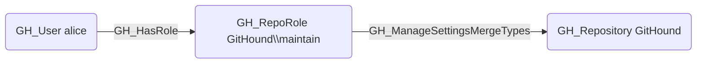

# GH_ManageSettingsMergeTypes

## Edge Schema

- Source: [GH_RepoRole](../Nodes/GH_RepoRole.md)
- Destination: [GH_Repository](../Nodes/GH_Repository.md)

## General Information

The non-traversable `GH_ManageSettingsMergeTypes` edge represents a role's ability to configure allowed merge types (merge commit, squash, rebase) on the repository. This permission is available to Maintain and Admin roles and custom roles that have been granted this specific permission.

