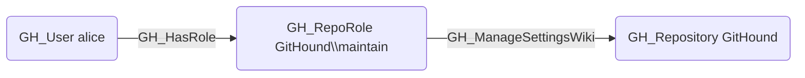

# GH_ManageSettingsWiki

## Edge Schema

- Source: [GH_RepoRole](../NodeDescriptions/GH_RepoRole.md)
- Destination: [GH_Repository](../NodeDescriptions/GH_Repository.md)

## General Information

The non-traversable [GH_ManageSettingsWiki](GH_ManageSettingsWiki.md) edge represents a role's ability to enable or disable the repository wiki. This permission is available to Maintain and Admin roles and custom roles that have been granted this specific permission.

